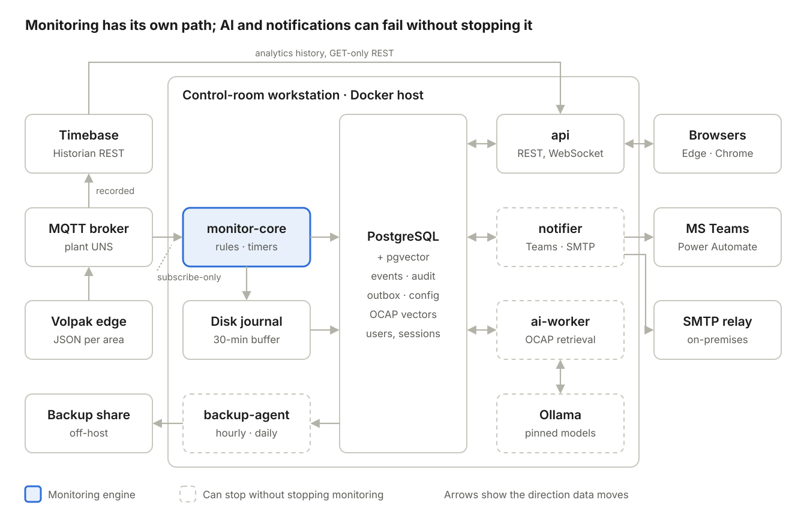
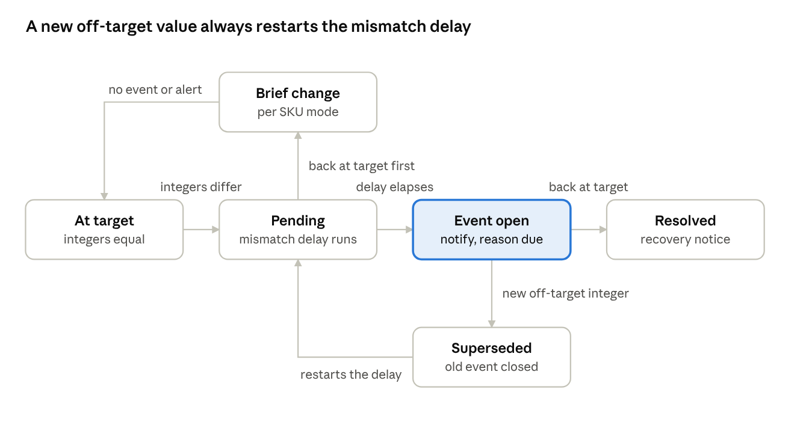
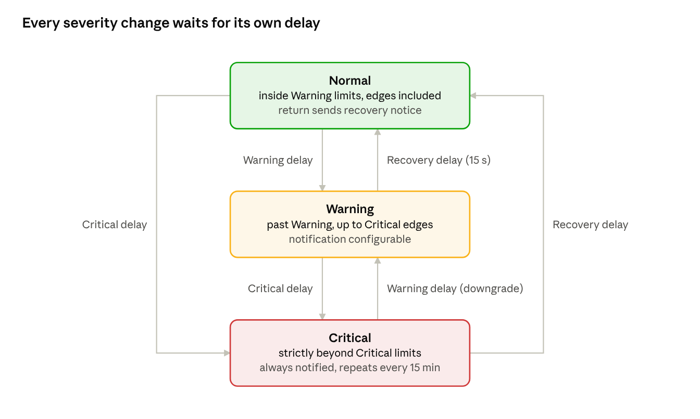
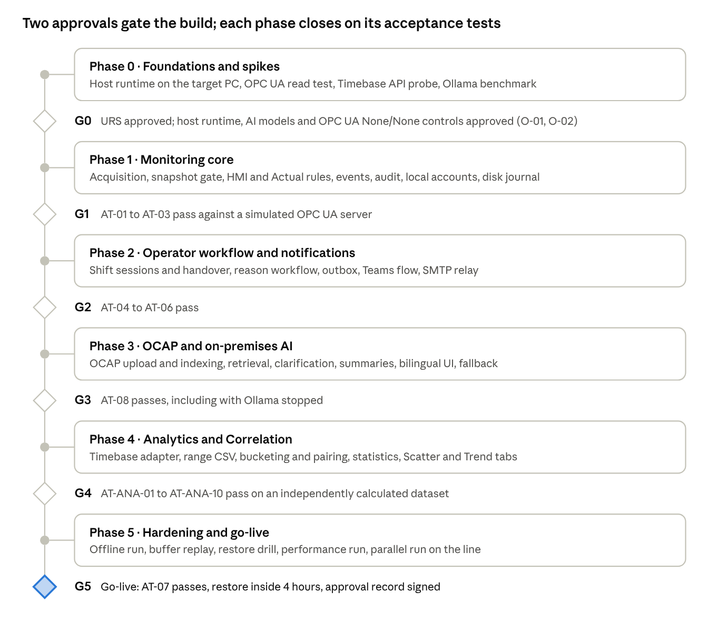

# Architecture Guide — Centerline Monitoring & OCAP Assistance

**Source:** System Design Document (SDD) v0.1 draft, 28 Sep 2026, built on URS v1.1 (not yet approved).
**Purpose:** the working reference for *implementing* the SDD. It restates the design as
rules, contracts and a build order a developer can follow, and lists where the current
Phase 1 UI prototype (`client/`) differs from the target.

> When this guide and the SDD disagree, the SDD wins; when the SDD and the URS disagree,
> the URS wins. Re-baseline this guide whenever the SDD is re-baselined.
>
> Decisions taken since the SDD are recorded in [decisions/](decisions/README.md); where an
> accepted ADR settles an open item, the ADR is authoritative for that item.
>
> **Status (2026-10-01):** Analytics & Correlation on Timebase is built
> ([ADR-0008](decisions/ADR-0008-analytics-on-timebase.md), [ADR-0009](decisions/ADR-0009-setpoints-in-analytics.md)).
> Timebase serves Analytics only. **Live data comes from the plant MQTT broker**
> ([ADR-0006](decisions/ADR-0006-mqtt-acquisition.md), resumed), and **Phase 0 is under way**:
> progress, evidence and open asks are in [phase-0.md](phase-0.md). What is monitored and analysed is
> defined by the [parameter register](../config/parameter-register.json) with zones
> ([ADR-0007](decisions/ADR-0007-parameter-register.md)). The broker, the historian and the
> register's tags are set on the **Configuration page** ([ADR-0011](decisions/ADR-0011-configuration-page.md)).
> Its **Mappings tab** says where each tag arrives on the broker ([ADR-0013](decisions/ADR-0013-tag-mappings.md)),
> and its **Rules tab** holds the monitoring rules (each zone's target, limits and delays). Both are
> versioned in **PostgreSQL**, which also keeps the register's versions and the audit log
> ([ADR-0012](decisions/ADR-0012-rules-configuration-postgresql.md)). Nothing is active until the owner
> activates a version. **Phase 1 has started**: monitor-core judges the simulator end to end
> ([ADR-0014](decisions/ADR-0014-monitor-core.md)), and the live **Digital Centerline page** shows what it
> judged: every zone's values and states, the open events and their evidence
> ([ADR-0015](decisions/ADR-0015-live-centerline-page.md)). Everyone signs in, and the api checks each
> account's roles on every call; a Manager acknowledges a Critical ([ADR-0016](decisions/ADR-0016-accounts-sign-in-and-roles.md)).
> Managers switch zones off and Administrators run maintenance windows ([ADR-0017](decisions/ADR-0017-monitoring-control.md)).
> The Alarms pages show the live events; the prototype's sample plant is gone ([ADR-0019](decisions/ADR-0019-alarm-pages-live.md)).
> monitor-core keeps a disk journal through database outages ([ADR-0018](decisions/ADR-0018-disk-journal.md)), and the
> services connect as a least-privilege role that can only add evidence ([ADR-0020](decisions/ADR-0020-database-roles.md)).
> The owner accepted the default delays ([ADR-0002](decisions/ADR-0002-default-delays.md)) and the broker's
> security as it is for now, so connecting to the real broker waits on the control-room PC test and M7 ([ADR-0021](decisions/ADR-0021-g0b-revised.md)).
> Centerline has no SKU: the rules give each zone its limits and its target, the line is judged once every zone has its limits, and a zone without a target is judged on its actual value only ([ADR-0027](decisions/ADR-0027-no-sku.md)).
> **Phase 2 has started**, notifications first: the notifier delivers the outbox to Teams and email by a versioned routing,
> with retries, TEST messages and re-drives on the Notifications page; the channels are placeholders until IT answers O-05 ([ADR-0023](decisions/ADR-0023-notifier.md)).
> The shift handover and the reason workflow followed: every HMI mismatch asks that shift's operator why, a Manager guides and the operator
> acknowledges, and the operator's session ends with its shift after a 5-min warning ([ADR-0025](decisions/ADR-0025-shifts-and-reasons.md)).
> Since 2026-10-02 the real application on the development laptop judges the real machine: monitor-core (read-only) and the
> notifier run on the real database; G0b now gates only the control-room PC ([ADR-0026](decisions/ADR-0026-real-app-on-the-real-machine.md)).
> On 2026-10-06 Phase 2's acceptance suites AT-04…06 passed. The pages poll rather than use a WebSocket, every POST that saves something
> carries an `Idempotency-Key`, and times end in `Z` ([ADR-0028](decisions/ADR-0028-polling-idempotency-g2-acceptance.md)). G2's sign-off waits on the real Teams flow and
> relay (O-05) and the HTTPS proxy. Phase 4 then closed: the Analytics-valid ranges became versions an Administrator uploads, and
> AT-ANA-01…10 passed on an independently calculated dataset, so **G4 is met** ([ADR-0029](decisions/ADR-0029-analytics-ranges-and-g4-acceptance.md)).
> The same day the application went into Docker: proxy, api, monitor-core, notifier and postgres, judging the real plant on a database of
> their own, as a rehearsal for the control-room PC ([ADR-0030](decisions/ADR-0030-docker-stack.md)).
> **Phase 3 began** the same day without its AI model (O-01 stays open): the **OCAP library**, where Managers upload PDF and Word
> OCAPs scanned by ClamAV, check the sections they're read into and activate them; a keyword search over the Active versions; the
> reason workflow's OCAP steps, up to three sections with their exact source; and a Manager's guidance with a file, or kept as a
> reusable OCAP ([ADR-0031](decisions/ADR-0031-ocap-library-deterministic-path.md)). The Docker stack then moved to plain HTTP by default, so testers'
> devices needn't trust a certificate; HTTPS stays one setting away, and go-live's choice is O-25 ([ADR-0032](decisions/ADR-0032-docker-stack-over-http.md)).
> The Digital Centerline page then gained a **line view**: the counts and the Volpak filler in 3D, drawn after its general
> arrangement, with each monitored zone a part coloured by monitor-core's states and the selected zone's values and checks
> beside it; the zone table below stays the full record ([ADR-0033](decisions/ADR-0033-line-view-3d.md)). On 2026-10-07 it became
> the owner's Blender model of the SI-360 ([ADR-0034](decisions/ADR-0034-line-view-blender-model.md)), and **Phase 5 began with the
> backups**: an hourly set kept here and off-host, checked by a daily restore, and a restore script
> ([ADR-0035](decisions/ADR-0035-backups-pg-dump.md)).

ID conventions used throughout (same as the SDD):

| Prefix | Meaning |
|---|---|
| `DD-nn` | Design decision (trade-offs in §14) |
| `A-nn` | Assumption — **confirm before building the code that depends on it** |
| `O-nn` | Open decision — **blocks detailed design** of the area it touches |
| `XXX-nn` | URS requirement ID. Cite it in code comments, commit messages and tests |

---

## Contents

1. [Scope in one page](#1-scope-in-one-page)
2. [Non-negotiable invariants](#2-non-negotiable-invariants)
3. [System architecture](#3-system-architecture)
4. [Repository layout](#4-repository-layout)
5. [Time budget of the critical path](#5-time-budget-of-the-critical-path)
6. [monitor-core — the monitoring engine](#6-monitor-core--the-monitoring-engine)
7. [Operator workflow, OCAP and AI](#7-operator-workflow-ocap-and-ai)
8. [notifier — outbox delivery](#8-notifier--outbox-delivery)
9. [Analytics & Correlation](#9-analytics--correlation)
10. [Data model](#10-data-model)
11. [API contract](#11-api-contract)
12. [Security, identity and sessions](#12-security-identity-and-sessions)
13. [Reliability, backup and operations](#13-reliability-backup-and-operations)
14. [Technology stack and decision log](#14-technology-stack-and-decision-log)
15. [Prototype → target gap analysis](#15-prototype--target-gap-analysis)
16. [Build roadmap and gates](#16-build-roadmap-and-gates)
17. [Assumptions and open decisions to close](#17-assumptions-and-open-decisions-to-close)
18. [Testing and traceability](#18-testing-and-traceability)

---

## 1. Scope in one page

**One line · 11 URS parameters (P01–P11), 5 of them active with 14 zones · 28 tags over MQTT**
([register](../config/parameter-register.json)). P01, P05, P07, P08, P10 and P11 are waiting for their tags.

| Capability | What it must do | URS |
|---|---|---|
| Acquisition | Subscribe (read-only) to the machine's MQTT area messages for every zone's setpoint and actual; detect stale areas and lost connections | OPC-01…08 (ADR-0006, ADR-0027) |
| Monitoring | HMI integer-mismatch rule and Actual Warning/Critical rules, with delays, supersede and recovery | HMI-01…05, ACT-01…04, MON-01 |
| Operator workflow | Per active mismatch per shift: one reason, ≤2 clarifications, one OCAP/guidance acknowledgment | WF-01…03, SES-01…05 |
| OCAP & AI | ≤3 approved OCAP sections, AI summary beside the exact source, English + Filipino | AI-01/02, OCP-01…03, GDE-01, LAN-01 |
| Notifications | Teams (Power Automate) + email (SMTP) from a durable outbox with retry and dedup | NOT-01…07 |
| Analytics | X/Y correlation over Timebase history: bucketing, Pearson r, least-squares regression | ANA-01…21 |
| Governance | Immutable records, retention, legal hold, exports, backup | DAT-01, RET-01/02, EXP-01, BKP-01 |

**Hard limits**

| Limit | Target | URS |
|---|---|---|
| Offline core | Runs with no internet / corporate WAN (only Teams needs WAN) | DEP-02 |
| Latency | Rule eval 2 s · event write 2 s · popup 3 s · first delivery attempt 10 s · AI result 30 s | PER-01 |
| Availability | 99.5 % monthly for the local core (~3.6 h downtime) | AVL-01 |
| Recovery | RPO 1 h · RTO 4 h · restore tested quarterly | BKP-02 |
| Capacity | 1,000 events + 10,000 lightweight changes / day · 50,000 queued messages · 1,000 OCAPs | CAP-01 |

**Platform constraints:** one Windows 11 (or LTSC) workstation; live data from the plant
MQTT broker (UNS), which also feeds Timebase; local accounts only; Teams flow owned by a
named person; Timebase is the source of truth for history.

**Out of scope — do not build:** WhatsApp; *any* write to the machine or historian;
Operator voice input (read-aloud output is allowed, A-09); product-quality disposition;
more than one line.

---

## 2. Non-negotiable invariants

Every PR must preserve these. Most have a test that must fail if the invariant breaks.

1. **Read-only to the plant.** No code path publishes to the MQTT broker or sends anything
   but GET to Timebase. The broker account is subscribe-only and a publish-rejection test
   proves it (ADR-0006 M3/M4); the MQTT wrapper has no publish and no Last Will (M6).
2. **Monitoring survives everything except loss of the MQTT feed.** monitor-core depends
   only on the broker and PostgreSQL *or* its disk journal. Browser, api, notifier,
   ai-worker, ollama and backup-agent may all be down without stopping monitoring (DEP-03).
3. **Services talk through PostgreSQL, not to each other.** No service-to-service HTTP
   on the monitoring path. Work is claimed from tables. Wake-ups were to use `LISTEN/NOTIFY`; on one line the
   services and pages poll instead ([ADR-0028](decisions/ADR-0028-polling-idempotency-g2-acceptance.md)).
4. **Evidence is append-only.** Event headers, transitions, inputs and snapshots are
   INSERT-once. The app DB role has only `INSERT, SELECT` on evidence tables and triggers
   reject `UPDATE`/`DELETE` (DAT-01).
5. **Every event is pinned to the config it was judged against** (`config_version_id`,
   `mapping_version_id`). Config changes never re-judge open events (OPC-07).
6. **One transaction per state change:** event + transition + workflow request +
   outbox rows are committed together or not at all (NOT-03).
7. **No evaluation on untrusted data.** Pause gate closes on any stale machine area (silent
   past its threshold), missing or invalid field, lost broker connection, rules that don't give
   every zone its limits, or maintenance window (OPC-03, OPC-08, MNT-01).
8. **AI never authors corrective instructions.** Every instruction shown comes verbatim
   from an approved OCAP section or a Manager. Citations outside the retrieved set are
   rejected server-side (AI-02, OCP-02).
9. **The server authorises every call** by role *and* line. The browser is never trusted
   (SEC-01).
10. **UTC everywhere except display.** Store and compute in UTC (`timestamptz`, ISO 8601
    with `Z`); the browser converts to Asia/Manila (UTC+8, no DST) (ANA-20, DEP-06).
11. **Idempotent by construction.** UUIDv7 IDs generated in monitor-core before the first
    write, unique dedup keys on notifications, `Idempotency-Key` on creating POSTs.
12. **Secrets are files, never env-baked or logged.** Mounted per service, read-only.
13. **Judge time by our own clock.** Freshness, order and evidence use monitor-core's
    NTP-synced arrival time; the payload `_timestamp` is kept as evidence only (the plant
    edge clock was 114 s off when measured, ADR-0006).

---

## 3. System architecture



Nine containers on one Docker host; PostgreSQL is the hub. Dashed boxes can stop without
stopping monitoring. Live data arrives from the plant MQTT broker, the same feed Timebase
records, so live monitoring and Analytics see the same values.

| Container | Responsibility | If it's down, monitoring… | URS |
|---|---|---|---|
| **monitor-core** | MQTT subscriber (read-only), snapshot gate, HMI + Actual rules per zone, durable timers, shift clock; writes events + outbox rows; heartbeat every 2 s, carrying the live values ([ADR-0015](decisions/ADR-0015-live-centerline-page.md)) | **stops — it *is* the monitor** | OPC (ADR-0006), HMI, ACT, MON-01, RES-01 |
| **postgres** (+pgvector) | System of record: config, events, audit, outbox, users, OCAP text + embeddings | continues — monitor-core journals to disk for 30 min | DAT-01, RES-01 |
| **api** | REST (polled; no WebSocket for one line, ADR-0028), login/sessions, workflow, config, the OCAP library (reading the files and the keyword search too, until the ai-worker exists: [ADR-0031](decisions/ADR-0031-ocap-library-deterministic-path.md)), exports, Analytics | continues | IAM, SES, WF, OCP, EXP, ANA |
| **proxy** (Caddy) | TLS, serves the web UI, overwrites client-IP header. Built: plain HTTP by default, HTTPS with Caddy's own CA by one setting ([ADR-0032](decisions/ADR-0032-docker-stack-over-http.md)) | continues | SEC-01, SES-04 |
| **notifier** | Outbox workers, one lane per channel; watches monitor-core heartbeat | continues | NOT-01…07 |
| **ai-worker** | OCAP parsing, embedding, retrieval, clarification, summary, translation | continues (deterministic fallback) | AI, OCP, LAN-01 |
| **ollama** | Pinned language + embedding models | continues | AI-01 |
| **clamav** (built, [ADR-0031](decisions/ADR-0031-ocap-library-deterministic-path.md)) | Scans every upload before storage (clamd's INSTREAM) | continues; uploads are refused until it answers | SEC-01 |
| **backup-agent** | **Built** as the `backup` container ([ADR-0035](decisions/ADR-0035-backups-pg-dump.md)): an hourly set (pg_dump of the database with its OCAPs, the roles, `deploy/config`), kept 48 h + 30 daily + 12 monthly, copied off-host, the day's first set restored and checked; the SDD had pgBackRest | continues | BKP-01/02 |

**DD-01** Acquisition and rules share one process — single writer per parameter, no race on
event state, 2 s budget met in-memory.
**DD-02** No internal message broker — outbox table + polling ([ADR-0028](decisions/ADR-0028-polling-idempotency-g2-acceptance.md); `LISTEN/NOTIFY` if ever needed) is enough at about
2 area messages/s and 1,000 events/day, and is one less thing to back up. The plant MQTT
broker is an input only; Centerline services never talk to each other through it.

### Host runtime (O-02, Critical)

| Option | Starts without login | Real client IP (SES-04) | GPU for Ollama | Verdict |
|---|---|---|---|---|
| **A. Hyper-V Linux VM + Docker Engine** | Yes | Yes (external switch) | Hard | **Recommended** |
| B. WSL2 + Docker Engine via boot task | Workable, soak test needed | Only with Win 11 mirrored networking (verify) | Yes (CUDA) | Fallback |
| Docker Desktop | **No** — needs interactive login (breaks DEP-05); paid licence | — | — | **Rejected** |

If the approved model needs a GPU: run Ollama on the Windows host, reachable only from the
VM, and record it as a DEP-01 deviation.

---

## 4. Repository layout

The web app is `client/` (React + Vite); the backend is **Python 3.12+ / FastAPI** (§14) in `services/`.
The prototype's empty `server/server.js` is gone. Layout, with what's built marked:

```
volpak-digital-centerline/
├─ client/                     React + TS UI (existing prototype, evolves in place)
│  ├─ src/services/            mockApi.ts → apiClient.ts (the single seam, keep it)
│  ├─ src/components/live/     (built, ADR-0015) the live Digital Centerline page: zone table, open events, event sheet;
│  │                           the line view and its 3D machine in live/twin/ (ADR-0033), the owner's Blender model
│  │                           from tools/twin-model/ (ADR-0034)
│  ├─ src/pages/ReasonsPage.tsx  (built, ADR-0025) the Reasons page, with components/workflow/ (the OCAP step and the
│  │                           guidance form too, ADR-0031); the shift warning is in components/auth/
│  └─ src/pages/OcapLibraryPage.tsx  (built, ADR-0031) the OCAP library: search, upload, versions, with components/ocap/
├─ services/
│  ├─ common/centerline_common/  (built) Timebase client (historian.py), register loader,
│  │                           db.py (connections, UUIDv7), migrate.py, rules.py (layer
│  │                           resolution, readiness) and mapping.py (coverage, checks,
│  │                           topic map/CSV): pure; shifts.py and workflow.py, the shift clock and
│  │                           the reason requests (ADR-0025); later: logging
│  ├─ monitor_core/centerline_monitor/   (built: first slice, ADR-0014)
│  │  ├─ rules.py              PURE: hmi_matches, classify (no I/O)
│  │  ├─ machines.py           PURE: HMI mismatch and Actual severity state machines per zone
│  │  ├─ gate.py, stoppause.py PURE: snapshot gate; Actual pause while stopped (ADR-0010)
│  │  ├─ engine.py             the judging step: gate + machines, timers, effects
│  │  ├─ store.py              one transaction per step; restart; ordered backlog while the DB is away;
│  │  │                        reason requests with their events, escalations, ended shifts (ADR-0025)
│  │  ├─ mqtt.py, service.py   read-only subscriber; the service loop, heartbeat, reloads
│  │  └─ journal.py            the disk journal during a database outage, replayed in order (RES-01, ADR-0018)
│  ├─ api/centerline_api/      (built: Analytics, Configuration, Monitoring, Accounts, Notifications, Reasons, OCAP) FastAPI app: routers per area (§11)
│  │  ├─ auth/                 accounts, sign-in, sessions, roles, the breached-password list (ADR-0016)
│  │  ├─ database.py           start-up (migrate, seed), a connection per request, runs without the DB
│  │  ├─ config/               connections, register, mappings and rules (ADR-0011…0013): stores, audit,
│  │                           versioning.py (activation shared by rules and mappings), routers
│  │  ├─ monitoring/           the live state from the heartbeat, events, brief changes (ADR-0015); acknowledging;
│  │                           control.py: zones switched off and maintenance windows (ADR-0017)
│  │  ├─ notifications/        the Notifications log, TEST messages, re-drives (ADR-0023); routing is in config/
│  │  ├─ ocap/                 the OCAP library (ADR-0031): scan.py (clamd), parse.py (PDF and Word into sections with
│  │  │                        their pages), store.py (versions, statuses, the keyword search), router.py
│  │  └─ workflow/             the reason workflow: requests, their steps with the OCAP choice, the follow-up questions,
│  │                           the guidance's file and reusable OCAP (ADR-0025, ADR-0031)
│  ├─ notifier/centerline_notifier/   (built, ADR-0023) routing, one lane per channel, retries and leases, the
│  │                           monitor-core watcher, its heartbeat; channels.py, routing.py, messages.py and outbox.py
│  │                           are in common/ (the api uses them for TEST messages and re-drives)
│  ├─ ai_worker/               ingest/, retrieve/, generate/, verify/, fallback/ (not yet: the api reads the files and
│  │                           searches by keyword until then, ADR-0031)
│  └─ backup_agent/            (built, ADR-0035) the hourly backup sets, their retention, off-host copy and restore check;
│                              deploy/restore.sh restores one
├─ db/
│  ├─ migrations/              (built: 0001 configuration … 0006 the services' role, 0007 placeholder SKU, 0008 notifications, 0009 the reason workflow, 0010 TRUNCATE guards, 0011 no SKU, 0012 idempotency keys, 0013 Analytics ranges, 0014 the OCAP library) plain SQL in order, recorded with hashes
│  └─ seed/                    rules-proposal.json (ADR-0012), routing-proposal.json (ADR-0023); later line, parameters, zones, units
├─ deploy/
│  ├─ dev/compose.yaml         (built) development PostgreSQL 17 + pgvector on 127.0.0.1:55432
│  ├─ compose.yaml             (built: 6 of the 9, [ADR-0030](decisions/ADR-0030-docker-stack.md); clamav, [ADR-0031](decisions/ADR-0031-ocap-library-deterministic-path.md)) health checks, restart policies; services.Dockerfile, web.Dockerfile
│  ├─ caddy/                   (built) http.Caddyfile (the default, ADR-0032) and https.Caddyfile, sharing app.caddy; the internal CA lives in a volume, never committed
│  ├─ config/                  (git-ignored) this host's settings and secrets, seeded by setup.sh
│  └─ offline-kit/             scripts to export images (by digest) + models
├─ config/                     files next to the database (ADR-0011, ADR-0012)
│  ├─ parameter-register.json  the register, exported after each save (the database is the source)
│  ├─ connections.json         broker + historian settings, no secrets (git-ignored)
│  ├─ secrets/                 passwords, token, CA certificate, database password; 0600 (git-ignored)
│  └─ history/                 old audit.jsonl (imported), copies of hand-edited register files (git-ignored)
├─ tools/                      Phase 0 tools (built)
│  ├─ common/register.py       shim to services/common (the tools share the api's code)
│  ├─ timebase-analysis/       Timebase probe, history download, delay analysis (O-03, O-08)
│  ├─ mqtt-probe/              read-only broker probe → topic-map.json (ADR-0006)
│  ├─ breached-passwords/      builds the api's offline breached-password list (ADR-0016)
│  ├─ mqtt-sim/                simulated Volpak publisher for dev and G1 (local broker only)
│  └─ notify-sink/             a local Teams flow and SMTP relay that keep what they receive (ADR-0023)
├─ tests/
│  ├─ acceptance/              (built: AT-04…06, ADR-0028; AT-ANA-01…10, ADR-0029; AT-08's deterministic part, ADR-0031) AT-01 … AT-08, AT-ANA-01 … AT-ANA-10
│  └─ fixtures/                (built, ADR-0029) analytics reference dataset + independent results
└─ docs/
   ├─ ARCHITECTURE.md          this file
   ├─ decisions/               ADRs
   └─ images/                  diagrams (container diagram updated for MQTT)
```

Rules for the layout:

- `monitor_core/rules/` contains **pure, unit-tested functions** only. This is the DD-01
  mitigation: a rules bug must be catchable without a broker.
- Code shared between services lives in `services/common/` and must not import FastAPI.
- The browser never imports anything that knows about Timebase credentials, broker details or tag names.

---

## 5. Time budget of the critical path

From "configured delay ends" to Operator popup ≈ 3 s; first delivery attempt ≈ 10 s.

| # | Component | What happens | Budget | URS |
|---|---|---|---|---|
| 1 | monitor-core | MQTT message for a machine area arrives (≈ 1/s; whole area in one JSON payload) | as published | OPC-02 |
| 2 | monitor-core | Snapshot gate: every mapped area fresh (SPC 30 s, Dosing 90 s), every field valid, every zone with its limits, else pause | in memory | OPC-03/05/08 |
| 3 | monitor-core | Rules against active config version; delay timers start/cancel | 2 s from step 1 | HMI-01, ACT-01, PER-01 |
| 4 | monitor-core | Delay ends → **one transaction**: event, transition, workflow request, outbox rows | 2 s | HMI-02, NOT-03 |
| 5 | api | The operator's page asks every 2 s and pops the request up ([ADR-0028](decisions/ADR-0028-polling-idempotency-g2-acceptance.md): polling instead of `LISTEN/NOTIFY` and a WebSocket) | 3 s | PER-01 |
| 6 | notifier | Worker claims outbox rows → first delivery attempt | 10 s | NOT-04 |
| 7 | Operator + ai-worker | Reason, clarifications, OCAP choice, acknowledgment | 30 s per AI call | WF-01, AI-02 |
| 8 | monitor-core | Workflow still open after 15 min → one Management escalation | timer | WF-03 |

Implementation notes:

- Instrument each step with a latency metric (evaluation latency is on the health page, §13).
- Nothing on steps 1–4 may await the api, notifier or ai-worker.
- The api must re-subscribe to `LISTEN` channels on reconnect and then reconcile by
  querying for events it may have missed (NOTIFY is not durable).

---

## 6. monitor-core — the monitoring engine

One state machine per **zone × rule family** (HMI mismatch, Actual severity), driven by
durable timers and a pause gate. A zone is one setpoint/actual pair of a URS parameter,
e.g. `P02.V3` (Vertical 3); see [ADR-0007](decisions/ADR-0007-parameter-register.md).

### 6.1 Acquisition over MQTT (OPC-01…08, [ADR-0006](decisions/ADR-0006-mqtt-acquisition.md))

- `aiomqtt` client, MQTT 5, TLS, subscribe-only account, keep-alive 5 s, **clean start**
  (no persistent session), QoS 1 on the area topics in the active tag mapping.
- The machine publishes **one JSON message per area** (`…/Volpak/Filler/SPC`,
  `…/Volpak/Filler/Dosing_Parameters`) holding every field plus `_timestamp` (epoch ms)
  and ISA-95 identity fields. One message refreshes a whole area.
- Tag → (topic, field) mapping comes from the mapping in effect (`active_mapping_version()`,
  [ADR-0013](decisions/ADR-0013-tag-mappings.md)). It's filled from the broker or from `tools/mqtt-probe`'s
  `topic-map.json` on the Mappings tab, and activated atomically (OPC-06/07), only when every
  monitored and machine-state tag has a place.
- Each reading stores `received_at` (our NTP clock) and `source_ts` (payload clock). If they
  differ by more than 5 s, the health page shows a clock-skew warning.
  **Built:** each transition's evidence keeps the zone's areas' `_timestamp` as `payload_clock`
  beside our time. monitor-core's heartbeat and `GET /api/v1/health` carry each area's skew and a
  warning past 5 s ([ADR-0014](decisions/ADR-0014-monitor-core.md), corrected 2026-10-01).
- A missing field, non-numeric value or NaN makes that tag unknown. There is no direct
  verification read (MQTT has none, so OPC-02's 30 s read is dropped).
- Broker connection lost (keep-alive or TCP): pause at once. Retry every 5 s for 1 min,
  then every 30 s.

Measured through Timebase on 2026-09-29: Dosing_Parameters ≈ 1 message/s with pauses of
25–60 s about 56 times a day; SPC ≈ 1/s in the last hour but gaps of up to about 20–25 s over
the previous day. The payload clock ran about 114 s slow.

### 6.2 Snapshot gate

Evaluation runs **only** when: connected to the broker **and** every mapped area has sent a
live message within its freshness threshold, set per area at ≥ 1.5 × the largest regular gap:
**SPC 30 s, Dosing_Parameters 90 s**, measured on 28 days of Timebase arrivals (ADR-0006; the
MQTT probe confirms them). The SDD's 10 s would pause monitoring 100–150 times a day; it can
return only if the edge publishes at a fixed ≤ 5 s interval. **and** every monitored field is present and valid **and** the rules in effect
give every zone its four limits **and** no maintenance window is active. Retained messages never count as fresh.

When the gate closes:
- stop evaluation **and** timers; write a `pause_period` row;
- keep open events open;
- incomplete rules, when everything else is in order, additionally alert Management once (OPC-08 as [ADR-0027](decisions/ADR-0027-no-sku.md) amends it).

**Resume** only after a complete, fresh snapshot: a live message from every mapped area
since the reconnect or pause, all fields valid (OPC-05).

**Built ([ADR-0017](decisions/ADR-0017-monitoring-control.md)):** a whole-line maintenance window closes the gate,
with "Maintenance: …" as the reason, and after it only messages from after its end count. A
window on chosen zones, and a zone a Manager switched off (MON-01), leave the gate open for
the rest of the line. Those zones aren't judged: a window holds their open events; switching
off closes them as "Monitoring disabled". Past its planned end a window stays in force,
overdue, and Management is alerted once.

### 6.3 HMI mismatch rule (HMI-01…05)



```python
import math

def hmi_integer(v: float) -> int:
    # Truncate toward zero: 180.9 → 180, 180.2 → 180, -0.7 → 0
    return math.trunc(v)

def hmi_matches(target: float, hmi: float) -> bool:
    return hmi_integer(target) == hmi_integer(hmi)
```

- Compare **whole numbers only** (URS default); always store the raw decimals (`raw_target`,
  `raw_hmi`) as evidence. The register can set another rule per parameter (method +
  decimals): P09 Pressure is under review because whole numbers can't tell 1.2 from 1.3 bar
  (O-17).
- States: **At target → Pending** (integers differ, mismatch delay runs) **→ Event open**
  (delay elapsed: notify, reason due) **→ Resolved** (back at target: recovery notice).
- A *new* off-target integer while an event is open → **Superseded** (old event closed,
  `supersedes_event_id` linked) and the delay **restarts** (HMI-03).
- Back at target before the delay ends → **Brief change**, handled per parameter (or zone) mode
  (HMI-05, A-04):

  | Mode | What is stored | Notifies / workflow? |
  |---|---|---|
  | Do not record | nothing | no |
  | **Lightweight record** (default) | minimal `lightweight_change` row | no |
  | Cleared-before-trigger | full evidence record | no |

- Separate brief periods are **never summed** (HMI-04).
- Default mismatch delay: **30 s**, measured on 28 days of Timebase history and accepted by the owner
  ([ADR-0002](decisions/ADR-0002-default-delays.md)). The knee is at 10 s, and 10–30 s give about the
  same result (about 21 events a day for the line). Always configuration, never a constant.

### 6.4 Actual-value severity (ACT-01…04)



Limits are **offsets around the raw HMI setpoint** (A-02): `W_low = hmi − w_off_low`,
`W_high = hmi + w_off_high`, same for Critical. Applies to every active zone, incl. P06
(A-11). **Actual rules run only while the machine runs** (`Machine_Run` = 1), skipping a
30 min warm-up after stops of ≥ 10 min; while paused they stop with their timers, and open
events stay open ([ADR-0010](decisions/ADR-0010-pause-actual-rules-when-stopped.md)). The accepted
delays and the proposed starting limits, both from 28 days of history, are in
[ADR-0002](decisions/ADR-0002-default-delays.md). Compare raw decimals; **each boundary belongs to the milder state**:

```python
def classify(x: float, w_low, w_high, c_low, c_high) -> Severity:
    if w_low <= x <= w_high:
        return Severity.NORMAL
    if c_low <= x <= c_high:        # i.e. c_low <= x < w_low  or  w_high < x <= c_high
        return Severity.WARNING
    return Severity.CRITICAL        # x < c_low or x > c_high
```

- Every transition waits for its own delay: Warning delay, Critical delay, Warning delay
  (downgrade), **Recovery delay** (URS default 15 s, ACT-02). Values come from the rules version in
  effect, per parameter and zone ([ADR-0012](decisions/ADR-0012-rules-configuration-postgresql.md), [ADR-0027](decisions/ADR-0027-no-sku.md)); the
  starting proposal is ADR-0002's.
- Return to Normal sends a recovery notice.
- Warning notifications are switchable per config; **Critical ones cannot be disabled** (ACT-03).
- **Critical repeat schedule** (A-03): first message T0, repeats T0+15, +30, +45, +60 min,
  final escalation T0+75 min → max 6 messages. An in-app **Manager acknowledgment stops
  the sequence** (ACT-04).

### 6.5 Durable timers, restarts, config changes

- Every delay, repeat and escalation is a `scheduled_action` row, mirrored by an in-memory
  scheduler.
- After any interruption, **incomplete timers restart from zero** — never resume a partial
  delay. The notification dedup key blocks duplicate *initial* notifications (MNT-02).
- New mapping or rule versions activate **atomically**, immediately or at a scheduled time
  (rules: `config_activation`, read with `active_config_version()`, ADR-0012);
  open events keep the version they were raised under (OPC-07).
- **Monitoring disabled** for a parameter: close the active event as *Monitoring disabled*,
  cancel dependent timers and workflows, keep initial notifications on record, send **no**
  recovery notice (MON-01). Who may disable — O-13.
- **No changeover** ([ADR-0027](decisions/ADR-0027-no-sku.md)): nothing is judged per product. A product change that moves
  setpoints raises HMI mismatches against the targets in effect until a Manager activates a
  version with the new targets; activation can be scheduled for the changeover time.

### 6.6 Database outage and the disk journal (RES-01/02)

- On DB failure keep evaluating; append every intended write to a protected disk journal
  with a monotonic sequence number.
- On recovery replay **in order**. UUIDv7 IDs + unique constraints make replay safe to repeat.
- Notifications raised during the outage go out after replay.
- Buffer = 30 min by default; when full → **protected degraded mode** (O-12).

**Built** ([ADR-0018](decisions/ADR-0018-disk-journal.md)): `data/journal/<instance>.jsonl` (0600, folder 0700), one line per step, flushed
before judging goes on; the database is tried again every 5 s; a restart replays the last run's
journal before anything else. Past 30 min the gate closes and nothing new is judged, so nothing is
dropped: the provisional degraded mode until O-12 decides the rest.

### 6.7 Shift clock and heartbeat

- Shifts start 06:00, 14:00, 22:00 Asia/Manila. Production Date = the Manila date the
  shift *starts* (22:00 shift belongs to its start date, A-07).
- monitor-core writes a heartbeat every 2 s. It carries every zone's values and states, which
  the Digital Centerline page shows ([ADR-0015](decisions/ADR-0015-live-centerline-page.md)).
  The notifier raises a Critical system alert to Management if it goes stale for 60 s (§8).
- **Built** ([ADR-0025](decisions/ADR-0025-shifts-and-reasons.md)): `centerline_common.shifts` gives each moment its shift, and a shift is a
  `shift_instance` row once something is recorded in it. Every 2 s monitor-core closes the
  unfinished reason requests of a shift that has ended, and escalates those open for 15 min.

---

## 7. Operator workflow, OCAP and AI

### 7.1 Workflow (WF-01…03, SES-05)

> **Built so far** ([ADR-0025](decisions/ADR-0025-shifts-and-reasons.md), [ADR-0031](decisions/ADR-0031-ocap-library-deterministic-path.md)): every step, without the AI: step 3 with fixed
> questions only, and step 5 without the summary.
> - The questions are two, and an Administrator edits them.
> - After the answers, up to three sections of the Active OCAPs are offered, found by keyword search (§7.2). With no match, or
>   "None of these apply", the request goes to a Manager's guidance.
> - A chosen section is shown in full under its citation (code, version, heading, pages), with its file; the operator
>   acknowledges it, which records review only.
> - A Manager's guidance can carry one PDF or Word file, scanned like an OCAP, and can be kept as a reusable OCAP, active at once.
> - The escalation and the drafts are as below. Polling replaces the WebSocket's purge ([ADR-0028](decisions/ADR-0028-polling-idempotency-g2-acceptance.md)): every 2 s for
>   an operator, and a closed request's status drops its draft.
> - At the shift's end an unfinished request closes as not answered, and the next shift's operator
>   gets a new one (O-11).
> - The AI (clarification questions, summaries, translation) waits for its model (O-01).

1. **Request** — created with the event, or at session activation for mismatches still
   active from the previous shift. `UNIQUE (event_id, shift_instance_id)` blocks repeats.
2. **Reason** — free text, English or Filipino. Store the **original unchanged**; any
   translation is stored beside it.
3. **Clarification** — at most **two** questions. If Ollama is slow (>30 s) or down, use
   fixed template questions.
4. **OCAP match** — up to **three** sections + "None of these apply".
5. **Review** — AI summary shown **beside the exact source section** with document,
   version, section and page. Acknowledgment records *review only*.
6. **No match** — Manager adds event-specific text (+ one optional PDF/Word) or creates a
   reusable OCAP (GDE-01).

- Still open 15 min after the request → one escalation to Management (A-05: clock starts
  at request creation).
- Unsent text lives **only** in browser `localStorage`; wipe it on logout, handover,
  takeover, cancellation, resolution or superseding. For the cases the browser can't detect, the request's
  status says it closed: a **purge** the browser reads on its next poll ([ADR-0028](decisions/ADR-0028-polling-idempotency-g2-acceptance.md); the SDD had a WebSocket message).

### 7.2 Retrieval pipeline (ai-worker)

> **Built so far, without the AI** ([ADR-0031](decisions/ADR-0031-ocap-library-deterministic-path.md)):
> - **Ingest** runs in the api: ClamAV (clamd), then pdfplumber or python-docx into sections with their pages, and chunks.
>   PDF headings are found by their size, weight or numbering, and each page's repeated headers and footers are dropped.
>   Word headings come from their styles; Word's pages are the breaks it recorded, so they're approximate.
> - **Index and Query** are PostgreSQL full-text search, the deterministic fallback below, and the only path until O-01
>   closes. English OCAPs use the `english` configuration. Filipino ones use `simple`, with Filipino function words
>   dropped. Headings and titles weigh more than the body.
> - **Versions:** a version is searched once a Manager activates it, with no second approval (OCP-03). It moves from
>   Draft to Active, then to Suspended or Superseded.
> - **Record:** the sections offered are kept with the request (`ocap_recommendation`, method `keyword`).
> - **Generate and Verify** come with the ai-worker.

| Stage | Design | URS |
|---|---|---|
| Ingest | Upload → ClamAV → text extraction keeping headings + page numbers (pdfplumber, python-docx) → sections → chunks | OCP-03, SEC-01 |
| Index | Embed chunks with the pinned embedding model into pgvector, tagged with OCAP version. Only **Active** versions (activated by a Manager, OCP-03) are searchable; suspending removes it in the same transaction | OCP-01 |
| Query | Event context (parameter, zone, direction, severity) + reason translated to English; merge vector + full-text results, group by section, keep top 3 | OCP-01, LAN-01 |
| Generate | Prompt holds **only** retrieved section text; model returns JSON `{summary, section_ids}` | AI-02 |
| Verify | Reject any citation outside the retrieved set → show source section **with no summary** | OCP-02 |
| Record | Store model digests, prompt template version, retrieved IDs, raw output with the event | DAT-01 |

**Guardrails**

- Pin models **by digest**, not tag (a tag can be re-pushed with other weights).
- Temperature 0, fixed versioned prompt templates.
- **Deterministic fallback** (keyword search, exact sections, template questions, no
  summary) whenever Ollama is down *or* a call exceeds 30 s. AT-08 must pass with Ollama stopped.
- Benchmark candidate models on real OCAPs in English and Filipino before O-01 closes
  (`bge-m3` is a sensible first embedding candidate).
- ai-worker uses its **own DB connection pool with statement timeouts** so AI queries
  cannot starve monitoring (DD-04).

---

## 8. notifier — outbox delivery

**Built** ([ADR-0023](decisions/ADR-0023-notifier.md)): routing versions on Configuration → Notifications, the notifier service with one
lane per channel, the Notifications page with TEST messages and re-drives, and the monitor-core watcher. Where it
differs from below: routing folds type and severity into nine kinds (one line today; Reason overdue came with
[ADR-0025](decisions/ADR-0025-shifts-and-reasons.md)), and a delivery is leased
for 2 min while it's attempted. The Teams flow and the relay are placeholders until O-05.

Each notification is written to the outbox **in the same transaction as its event**, then
delivered per channel with independent status, so a Teams outage never blocks email.

| Table | One row per | Key fields |
|---|---|---|
| `notification` | logical message (initial, repeat, escalation, recovery, system) | event_id, type, severity, frozen payload, routing snapshot |
| `notification_delivery` | message × channel × target | status, attempt_count, next_attempt_at, last_error, **dedup_key UNIQUE** |
| `delivery_attempt` | attempt (append-only) | time, outcome, provider response |

**Statuses:** Pending · Attempting · Delivered (Teams) / Submitted (SMTP) · Retrying ·
Permanent failure · Re-driven.

**Claiming work** — one lane per channel:

```sql
SELECT id FROM notification_delivery
WHERE channel = :channel AND status IN ('PENDING','RETRYING') AND next_attempt_at <= now()
ORDER BY next_attempt_at
FOR UPDATE SKIP LOCKED
LIMIT :batch;
```

**Retry schedule (NOT-04/05)**

| Attempt | Wait after previous |
|---|---|
| 1 | within 10 s of creation |
| 2 | 30 s |
| 3 | 1 min |
| 4 | 5 min |
| 5+ | every 15 min until 24 h after creation → **Permanent failure** |

**Teams** — POST JSON to the authenticated Power Automate HTTP trigger; the flow posts as
Flow bot. **HTTP 202 = Delivered.** A timeout after sending = unknown → retry with the
**same dedup key**, which also appears in the message footer. Trigger auth: signed URL vs
Entra ID tokens — **O-05**.

**Email** — Submitted = relay answered **250 after the DATA body**; never resubmit after
that (NOT-06). Connection dropped before 250 → retry with the **same Message-ID**.

**Routing & admin** — rules match line × type × severity × channel → targets; the matched
rule is **frozen** onto each notification. Only Administrators may send
`TEST - NO PRODUCTION EVENT` messages or re-drive a Permanent failure, and re-drive needs a
reason (NOT-05, NOT-07).

**Offline** — without WAN, Teams keeps retrying while email continues via the on-prem relay.

**Watching the watcher** — heartbeat from monitor-core stale for 60 s → Critical system
alert to Management (SDD addition).

---

## 9. Analytics & Correlation

**Built** ([ADR-0008](decisions/ADR-0008-analytics-on-timebase.md)): `services/api/centerline_api/analytics/`
and `client/src/pages/AnalyticsCorrelationPage.tsx`; how to run it is in
[services/api/README.md](../services/api/README.md).

Computed **on request** from Timebase, returned once, **not stored** (only query metadata
is kept and audited). Scatter and Trend render from the same result (ANA-03, -15, -21).

### 9.1 Pipeline (api)

1. **Validate** — shift = All or one; X ≠ Y,
   both analytics variables: the **actual value or setpoint** of any active zone, plus the
   `analytics_only` P08 actual ([ADR-0009](decisions/ADR-0009-setpoints-in-analytics.md));
   channels `P02.V1.actual` / `P02.V1.setpoint`, shown as "Vertical 1 · Setpoint";
   bucket ∈ {10 s, 30 s, 1 min, 5 min, 15 min, 1 h}; aggregation ∈ {AVG, MIN, MAX};
   range not in the future, ≤ configured max (30 days default) (ANA-04…07, -18).
2. **Fetch** — `HistorianClient` adapter pulls X and Y in UTC; the shift comes from the timestamp (ADR-0008). Probed facts
   (O-03, [tools/timebase-analysis](../tools/timebase-analysis/README.md)):
   `GET http://10.156.116.179:4516/api/datasets/dressings/data?tagname=…&tagname=…&unixStart=…&unixEnd=…`;
   the first point per tag is the value in force at the start; values are stored on change;
   **no aggregation parameters**, so fetch raw samples; one unknown tag fails the whole request
   (404); some spans answer HTTP 500 or a **truncated body**, so validate every response and fall
   back to per-tag, smaller windows. The client (`centerline_common.historian`) keeps connections
   alive, fetches 6 h windows three at a time and remembers unreadable spans.
3. **Clean** — drop null, non-numeric, NaN, ±∞, bad-quality and out-of-range samples;
   **count each reason separately** (ANA-09/10).
4. **Step series** — Timebase stores on change, so a value **holds until the next sample**; an
   excluded sample makes the value unknown until the next one. A machine area silent for more
   than 120 s (its `_timestamp` stops) is a **data gap**.
5. **Bucket** — `bucket_start = floor(utc_seconds / interval) * interval`, same for X and Y:
   **time-weighted AVG**, or the MIN / MAX **in force** during the bucket. A bucket counts when
   **≥ 50 % of it is known**. Shift comes from the Manila time of day (O-06 closed).
6. **Pair** — keep a bucket only if both X and Y are valid (and in the chosen shift); **never
   fill gaps with zero**.
7. **Size guard** — > 10,000 pairs → no chart; recommend the smallest larger interval that
   fits (ANA-19), computed exactly on the data already fetched.
8. **Compute & return** — one JSON payload: pairs, stats, group stats, exclusion counts,
   warnings.

### 9.2 Statistics

$$
r = \frac{\sum (x_i-\bar{x})(y_i-\bar{y})}{\sqrt{\sum (x_i-\bar{x})^2 \sum (y_i-\bar{y})^2}}
\qquad b = r\,\frac{s_y}{s_x} \qquad a = \bar{y} - b\,\bar{x} \qquad R^2 = r^2
$$

- 64-bit floats, **two-pass** method (large offsets like 180 °C must not lose precision).
- Sample standard deviation, **n − 1** (A-08).
- < 3 pairs, or constant X or Y → **"Not computable" + reason**, never a number.
- Strength label (ANA-13) uses **unrounded |r|** (0.3996 is Weak even if shown as 0.40);
  direction is shown separately.
- Every result carries the fixed note: *correlation shows association, not causation* (ANA-14).
- Group stats (ANA-17): < 3 pairs = Insufficient data; 3–29 = Low sample size; max 10
  groups visible — the **10 most recent** production dates (proposed default for O-10).
- Validate results against an independent tool for AT-ANA-05. **Done** ([ADR-0029](decisions/ADR-0029-analytics-ranges-and-g4-acceptance.md)): `tests/fixtures/analytics/independent.py`,
  standard library with exact fractions and 50-digit decimals, and a CSV for a spreadsheet check.

### 9.3 Analytics-valid ranges CSV (ANA-10/11)

Columns `parameter_id, unit, valid_min, valid_max`; exactly one row for each P01–P11.
Whole file accepted or rejected: units must match the parameter register, `min < max`.
Store original bytes, SHA-256, version number and the Administrator's reason. Rollback
reactivates an earlier version and writes its own audit row.
**Built** ([ADR-0029](decisions/ADR-0029-analytics-ranges-and-g4-acceptance.md), migration 0013): an Administrator uploads the file on Configuration → Analytics
ranges; `analytics_range_version` keeps it byte for byte with its SHA-256, the register version, the reason and who
saved it, `analytics_range` its rows, `analytics_range_activation` when each takes effect. Queries use the version
in effect, re-checked against the register as it is now, and each result names it. The api config's `ranges_csv`
is retired.

### 9.4 Front end

Apache ECharts 6 for both tabs, lazy-loaded with the page: dual Y-axes when units differ,
visible gaps for missing buckets, tooltips, zoom, pan, reset. Setpoints are drawn dashed on
top of actuals. Historian credentials stay in the api container. The picker lists zones by
name (Vertical 1, Vertical 2, …) with an Actual / Setpoint toggle; no parameter IDs are shown
(ADR-0009). An analysis can be linked:
`/analytics?x=P02.V1.setpoint&y=P02.V1.actual&hours=168&bucket=PT5M&view=trend`.

Measured on the plant Timebase: 24 h in 0.4 s, 7 days in 1.3 s, 30 days in 5–14 s
(the Dosing area's one-per-second heartbeat dominates).

---

## 10. Data model

PostgreSQL 17+ with pgvector. All timestamps `timestamptz` in UTC.

| Area | Tables | Notes |
|---|---|---|
| Reference | `line`, `parameter`, `parameter_zone` | Seeded from the register: P01–P11 with units, zones with their tags and status |
| Configuration | `config_version`, `parameter_rule` (per parameter, optional zone override), `tag_mapping_version`, `tag_mapping` (tag → topic + field), `analytics_range_version`, `analytics_range`, `routing_rule` | Versioned with content hash; immediate or scheduled activation; rollback reactivates an earlier version; `version` column for optimistic locking. **Built** ([ADR-0012](decisions/ADR-0012-rules-configuration-postgresql.md), [ADR-0013](decisions/ADR-0013-tag-mappings.md)): `config_version`, `parameter_rule` (a zone or every zone of the parameter; `sku_parameter_rule` until [ADR-0027](decisions/ADR-0027-no-sku.md)), `config_activation`, `mapping_version`, `tag_mapping`, `mapping_activation`, `register_version`, the Analytics-valid ranges `analytics_range_version`, `analytics_range` and `analytics_range_activation` ([ADR-0029](decisions/ADR-0029-analytics-ranges-and-g4-acceptance.md)), and the hash-chained `audit_log`, append-only by trigger. What was saved about SKUs before ADR-0027 stays in `legacy_*` columns that new rows can't fill |
| Monitoring | `event`, `event_transition`, `event_state`, `lightweight_change`, `scheduled_action`, `pause_period` | UUIDv7 IDs from monitor-core; `lightweight_change` partitioned by month; `event_state` is a projection rebuildable from transitions. **Built** (migration 0003, [ADR-0014](decisions/ADR-0014-monitor-core.md)) with `notification` (the outbox), `event_acknowledgment` and `monitor_heartbeat`; partitioning comes when volumes need it |
| Workflow | `shift_instance`, `workflow_request`, `operator_input`, `clarification`, `ocap_recommendation`, `acknowledgment`, `manager_guidance` | `UNIQUE (event_id, shift_instance_id)`. **Built** (migration 0009, [ADR-0025](decisions/ADR-0025-shifts-and-reasons.md)): `shift_instance`, `workflow_request`, `workflow_entry` (the reason, answers, guidance and acknowledgment in one append-only table, in place of `operator_input`, `clarification`, `manager_guidance` and `acknowledgment`), `workflow_settings` (the follow-up questions, append-only). Migration 0014 ([ADR-0031](decisions/ADR-0031-ocap-library-deterministic-path.md)) adds `ocap_recommendation` (the sections offered, with their score and method), the OCAP choice as a `workflow_entry`, and `workflow_attachment` (the guidance's file, scanned) |
| OCAP | `ocap_document`, `ocap_version`, `ocap_section`, `ocap_chunk` | Status Draft / Active / Suspended / Superseded; chunk holds the embedding. **Built** (migration 0014, [ADR-0031](decisions/ADR-0031-ocap-library-deterministic-path.md)): each file byte for byte with its SHA-256 and scan verdict; sections with their headings and pages; chunks with a full-text `tsvector` (the embedding comes with the ai-worker); statuses in the append-only `ocap_status`, a row per change, read through `ocap_version_status`. Every table is append-only |
| Notification | `notification`, `notification_delivery`, `delivery_attempt` | `dedup_key` unique. **Built** ([ADR-0023](decisions/ADR-0023-notifier.md)): also `notification_route` (the frozen routing), `routing_version`/`routing_activation`, `notifier_heartbeat`; a finished delivery can't change (NOT-06) |
| Identity | `user_account`, `role`, `user_role`, `session`, `auth_event`, `password_history` | Argon2id hashes only. **Built** (migration 0004, [ADR-0016](decisions/ADR-0016-accounts-sign-in-and-roles.md)) as `app_user` (roles as an array; Operator alone), `app_user_login` (each sign-in name unique across kinds), `app_session` (token stored as SHA-256), `app_user_password`; sign-in events go to the hash-chained `audit_log` |
| Governance | `audit_log`, `retention_policy`, `legal_hold`, `maintenance_window`, `backup_run` | `audit_log` **hash-chained**. **Built so far:** `audit_log` (0001); `maintenance_window` and the append-only `monitoring_switch` (0005, [ADR-0017](decisions/ADR-0017-monitoring-control.md)) |

### Event header

| Column | Type | Purpose |
|---|---|---|
| `id` | uuid v7 | Time-ordered, set before first write |
| `line_id`, `parameter_id`, `zone_id` | FK | What was monitored |
| `kind` | `HMI_MISMATCH` \| `ACTUAL` | Rule family |
| `raw_target`, `raw_hmi`, `raw_actual` | numeric | Raw decimals as evidence |
| `config_version_id`, `mapping_version_id` | FK | Config it was judged against |
| `opened_at` | timestamptz | Delay end time |
| `supersedes_event_id` | uuid | HMI-03 link |

### Enforcing immutability

```sql
-- app role: evidence is insert-and-read only
GRANT SELECT, INSERT ON event, event_transition, operator_input, ... TO app_rw;

CREATE FUNCTION reject_mutation() RETURNS trigger LANGUAGE plpgsql AS $$
BEGIN RAISE EXCEPTION 'evidence table % is append-only', TG_TABLE_NAME; END $$;

CREATE TRIGGER event_immutable BEFORE UPDATE OR DELETE ON event
  FOR EACH ROW EXECUTE FUNCTION reject_mutation();
```

A separate **purge role** deletes only rows past retention and not under legal hold, and
every purge writes an audit row (RET-02). `audit_log` rows carry `prev_hash` and
`row_hash = sha256(prev_hash || canonical_row)` so gaps or edits are detectable.

### Retention defaults (RET-01)

| Record class | Retention |
|---|---|
| Core events, evidence, configuration, security records | 5 years |
| Notification history | 2 years |
| Authentication and session records | 1 year |
| Diagnostic logs | 90 days |

### Size planning

~18 M lightweight rows over 5 years (~4 GB before indexes), ~1.8 M events, OCAP
attachments up to 20 GB. **Plan ~100 GB protected storage** incl. models and images;
backups off-host.

---

## 11. API contract

One REST API under `/api/v1`. The SDD's WebSocket at `/api/v1/ws` isn't built: on one line the pages poll ([ADR-0028](decisions/ADR-0028-polling-idempotency-g2-acceptance.md)).

### Conventions

- JSON bodies; timestamps ISO 8601 UTC ending in `Z` (**built**, [ADR-0028](decisions/ADR-0028-polling-idempotency-g2-acceptance.md): one formatter, `centerline_common.isotime`).
- Cursor pagination on lists.
- `Idempotency-Key` header required on every POST that creates a record (**built**, [ADR-0028](decisions/ADR-0028-polling-idempotency-g2-acceptance.md)): the answer is kept
  24 h and replayed for the same key; signing in and the POSTs that save nothing are exempt.
- `version` field for optimistic locking on configuration.
- Errors as **RFC 9457** problem details (`application/problem+json`).
- Exports are background jobs (`POST /exports` → poll `GET /exports/{id}`).
- Role **and** line checked server-side on every call.

### Endpoints

| Area | Endpoints | Roles |
|---|---|---|
| Auth (built, [ADR-0016](decisions/ADR-0016-accounts-sign-in-and-roles.md)) | `POST /auth/login`, `/auth/takeover` (no sign-in); `GET /auth/session`, `POST /auth/activity`, `/auth/password`, `/auth/logout` | All |
| Live | `GET /ws` — popups, event changes, handover warnings, draft purge, session revocation. Not yet: the Digital Centerline page polls every 2 s ([ADR-0015](decisions/ADR-0015-live-centerline-page.md)), and the reason requests every 2 s for an operator, 5 s for others ([ADR-0025](decisions/ADR-0025-shifts-and-reasons.md)) | All |
| Monitoring (built, [ADR-0015](decisions/ADR-0015-live-centerline-page.md)) | `GET /monitoring/live` (monitor-core's heartbeat with every zone's values and states, and the open events), `GET /monitoring/brief-changes` | All once login exists. No login yet: 127.0.0.1 only |
| Events | `GET /events` (filters, cursor paging, [ADR-0019](decisions/ADR-0019-alarm-pages-live.md)), `GET /events/counts`, `GET /events/export.csv` (Manager, Administrator: EXP-01), `GET /events/{id}` (built, [ADR-0015](decisions/ADR-0015-live-centerline-page.md): transitions, notifications, the pinned rule and versions, and its reason requests, [ADR-0025](decisions/ADR-0025-shifts-and-reasons.md)); `POST /events/{id}/acknowledge` (built, [ADR-0016](decisions/ADR-0016-accounts-sign-in-and-roles.md): once per Critical period) | Every role reads; a Manager acknowledges |
| Workflow (built, [ADR-0025](decisions/ADR-0025-shifts-and-reasons.md)) | `GET /workflow/requests` (an operator: the shift's; others: the open ones and the last day's), `GET /workflow/requests/{id}`; `POST /workflow/requests/{id}/reason`, `/answers`, `/ocap` (one of the sections offered, or none: [ADR-0031](decisions/ADR-0031-ocap-library-deterministic-path.md)), `/acknowledge`; `GET /workflow/attachments/{id}`; the follow-up questions: `GET`/`PUT /config/workflow` | Every role reads; the shift's operator writes; questions: Manager and Administrator read, Administrator changes |
| Guidance (built, [ADR-0025](decisions/ADR-0025-shifts-and-reasons.md)) | `POST /workflow/requests/{id}/guidance`: the text, one PDF or Word file, and optionally a reusable OCAP (ADR-0031) | Manager |
| OCAP (built, [ADR-0031](decisions/ADR-0031-ocap-library-deterministic-path.md)) | `GET /ocaps`, `GET /ocaps/search`, `GET /ocaps/versions/{id}`, `…/original`, `GET /ocaps/sections/{id}`; `POST /ocaps`, `POST /ocaps/{id}/versions`, `POST /ocaps/versions/{id}/activate`, `…/suspend` | Every role reads and searches; a Manager uploads, activates and suspends |
| Rules (built, [ADR-0012](decisions/ADR-0012-rules-configuration-postgresql.md)) | `GET /config/rules`, `GET /config/rules/proposal`; `GET`/`POST /config/versions`, `POST /config/versions/check`, `POST /config/versions/{n}/activate`, `POST /config/activations/{id}/cancel` | Read: Manager, Administrator. Change: Manager ([ADR-0016](decisions/ADR-0016-accounts-sign-in-and-roles.md)) |
| Mappings (built, [ADR-0013](decisions/ADR-0013-tag-mappings.md)) | `GET /config/mappings`; `GET`/`POST /config/mappings/versions`, `POST /config/mappings/versions/check`, `POST /config/mappings/versions/{n}/activate` (an older one is a rollback), `GET /config/mappings/versions/{n}/export.csv`; `POST /config/mappings/activations/{id}/cancel`; `POST /config/mappings/import`, `POST /config/mappings/discover` | Read: Manager, Administrator. Change, import included: Administrator ([ADR-0016](decisions/ADR-0016-accounts-sign-in-and-roles.md)) |
| Monitoring control (built, [ADR-0017](decisions/ADR-0017-monitoring-control.md)) | `GET /monitoring/control`; `POST /monitoring/switch` (a zone or a parameter's zones, off with a reason, or on); `GET`/`POST /maintenance`, `POST /maintenance/{id}/extend`, `/end` | Every role reads; switching: Manager; maintenance: Administrator |
| Notifications (built, [ADR-0023](decisions/ADR-0023-notifier.md)) | `GET /notifications` (filters, cursor paging), `GET /notifications/{id}`; `POST /notifications/test`, `POST /deliveries/{id}/redrive`; routing: `GET /config/routing`, `/config/routing/proposal`, `GET`/`POST /config/routing/versions`, `/check`, `/{n}/activate`, `POST /config/routing/activations/{id}/cancel`; channels: `PUT /config/connections/notifications`, `POST …/email-test` | Read: Manager, Administrator. TEST, re-drive, routing and channels: Administrator |
| Accounts (built, [ADR-0016](decisions/ADR-0016-accounts-sign-in-and-roles.md)) | `GET`/`POST /users`, `PUT /users/{id}` (no delete: accounts are disabled), `POST /users/{id}/temporary-password` | Administrator |
| Analytics (built) | `GET /analytics/options`, `POST /analytics/query`; ranges ([ADR-0029](decisions/ADR-0029-analytics-ranges-and-g4-acceptance.md)): `GET /config/analytics-ranges`, `…/template.csv`, `…/versions/{n}`, `…/versions/{n}/original.csv`; `POST …/versions/check`, `…/versions`, `…/versions/{n}/activate`, `…/activations/{id}/cancel` | Manager + Administrator ([ADR-0016](decisions/ADR-0016-accounts-sign-in-and-roles.md)); ranges changed by an Administrator |
| Configuration (built, [ADR-0011](decisions/ADR-0011-configuration-page.md)) | `GET /config/connections`; `PUT /config/connections/historian` \| `/mqtt`; `POST /config/connections/historian/test` \| `/mqtt/test`; `GET /config/historian/tags`; `POST /config/historian/latest`; `GET /config/register`; `PUT /config/register/parameters/{id}` | Read: Manager, Administrator. Change: Administrator ([ADR-0016](decisions/ADR-0016-accounts-sign-in-and-roles.md)) |
| Exports | `POST /exports`, `GET /exports/{id}` | Manager, Administrator |
| Health (built) | `GET /health` (Administrator); `GET /health/live` (no sign-in: for container health checks) | Administrator |

### Example — analytics query

```http
POST /api/v1/analytics/query
{
  "shift": "ALL",
  "from": "2026-09-27T00:00:00Z",
  "to":   "2026-09-28T00:00:00Z",
  "x": "P02.V1",
  "y": "P06.N1",
  "bucket": "PT1M",
  "aggregation": "AVG",
  "groupBy": "NONE",
  "groupStats": false
}
```

Response: pairs `(bucket_start, x, y, group)`, per-series counts + descriptive stats,
exclusion counts by reason, `r`, slope, intercept, R², strength label, direction, warnings.

### WebSocket message types (suggested; not built, ADR-0028)

`event.opened`, `event.updated`, `event.closed`, `workflow.request`, `handover.warning`,
`draft.purge`, `session.revoked`. Every message carries `type`, `id`, `at` (UTC) and a
payload; the client treats WS as a hint and refetches via REST on reconnect.

---

## 12. Security, identity and sessions

> **Built** ([ADR-0016](decisions/ADR-0016-accounts-sign-in-and-roles.md)): accounts, passwords, sessions and roles as described here, in
> `services/api/centerline_api/auth/`, with the first Administrator created on the server's command line.
> The shift-boundary handover (SES-03) followed in Phase 2 ([ADR-0025](decisions/ADR-0025-shifts-and-reasons.md)). Still to come: HTTPS through the proxy. There are no WebSockets to close ([ADR-0028](decisions/ADR-0028-polling-idempotency-g2-acceptance.md)).

### Accounts and passwords (IAM-02…04)

- Login by email, Employee ID or username — each unique **case-insensitively** (`citext`
  or lower-cased unique index).
- Argon2id; min 12 chars; checked against an **offline** breached-password list; last 5
  passwords blocked; 5 failures → 15 min lockout.
- Temporary passwords expire in 24 h and force a change at first login.
- Role change, disablement or reset **deletes every session row immediately**, so the next request of any of
  them is refused — the reason sessions are server-side, not JWTs (DD-06).

### Sessions

| Rule | Operator | Manager / Administrator | URS |
|---|---|---|---|
| Concurrency | One active session for the line | ≤ 10 privileged sessions total | SES-01 |
| Inactivity | No timeout | 15 min, warning at 13 min | SES-02 |
| Where | Primary or backup workstation IP only | Any plant-LAN browser (A-10) | SES-04 |
| Takeover | Session with no heartbeat for 5 min can be taken over; same workstation resumes within 5 min | n/a | SES-04 |
| Shift boundary | Warning 5 min before 06:00/14:00/22:00; at the boundary the session ends, unsent text is cleared and the next shift's operator signs in ([ADR-0025](decisions/ADR-0025-shifts-and-reasons.md); O-11 closed) | n/a | SES-03 |

- The proxy **overwrites** the client-IP header; api trusts it **only from the proxy**.
- Cookies: `HttpOnly; Secure; SameSite=Strict`. Over the Docker stack's plain HTTP, not `Secure` ([ADR-0032](decisions/ADR-0032-docker-stack-over-http.md)).

### Role capabilities

Decided in [ADR-0016](decisions/ADR-0016-accounts-sign-in-and-roles.md) (O-13). One account may be Manager, Administrator or both; an Operator
account has only that role, because its session rules differ.

| Capability | Role |
|---|---|
| Reason, clarification, OCAP choice and acknowledgment | Operator |
| Critical acknowledgment; brief-change mode; OCAP upload, activation and suspension; event guidance with its file or reusable OCAP | Manager |
| Exports | Manager, Administrator |
| Accounts, temp passwords, legal hold, maintenance, re-drive, TEST messages, Analytics ranges | Administrator |
| Rules tab: targets, limits, delays | Manager |
| Connections, Tags and Mappings, mapping import included | Administrator |
| Monitoring disable (MON-01) | Manager |
| Analytics access | Manager, Administrator |

### MQTT broker and historian controls (SEC-02, [ADR-0006](decisions/ADR-0006-mqtt-acquisition.md) M1–M7) — M1–M5 accepted as they are for now ([ADR-0021](decisions/ADR-0021-g0b-revised.md))

- TLS to the broker with the plant CA (M1); dedicated account and client ID (M2).
- Broker ACL: subscribe-only on the Volpak subtree, no publish anywhere (M3), proven by a
  publish-rejection test on a dedicated test topic (M4).
- Firewall: the broker port reachable from the Centerline VM (M5).
- In code: no publish and no Last Will in the MQTT wrapper (M6). Tests check both clients, and scan the
  services' code for anything that sends.
- Timebase answers reads **without a token** today: the Timebase admin must confirm that
  unauthenticated `POST`/`DELETE` are refused (M7). The client only sends GET, and a test checks it (`test_read_only.py`). The owner decides whether M7
  stays in G0b (ADR-0021).

### Platform

- HTTPS on the LAN via internal-CA certificate (Caddy). The Docker stack serves plain HTTP for testing until the owner
  decides go-live's scheme (O-25, [ADR-0032](decisions/ADR-0032-docker-stack-over-http.md)).
- Secrets for DB, Timebase, Power Automate, SMTP mounted as files readable only by the
  service that needs them; never in images or logs. Until then the Configuration page writes
  the broker and historian secrets to `config/secrets/` (0600) and never returns them
  ([ADR-0011](decisions/ADR-0011-configuration-page.md)); the development database's password is
  generated there too (`postgres-password`, [ADR-0012](decisions/ADR-0012-rules-configuration-postgresql.md)), and the
  services' role's (`postgres-app-password`, [ADR-0020](decisions/ADR-0020-database-roles.md)): the api and monitor-core
  connect as `centerline_app`, which can only add and read evidence; migrations run as the owner.
- Images and models pinned by digest and scanned before promotion.
- ClamAV signatures need an approved offline update route.
- **Audit** every login, role change, activation, re-drive, hold, export and Analytics
  query with who, when, what and why.

---

## 13. Reliability, backup and operations

One workstation = single point of failure; 99.5 % is met by **fast recovery**, not
redundancy. A single 4 h restore consumes a month's budget → keep a **pre-staged spare PC**.

### Failure behaviour

| Failure | Behaviour | Recovery | URS |
|---|---|---|---|
| Broker connection lost | Pause at once (keep-alive 5 s); retry 5 s for 1 min, then 30 s | Resume after a live message from every area | OPC-03/05 |
| Edge publisher stops (broker up) | Area silent past its threshold → pause; a liveness/Last Will topic, if the edge provides one, pauses sooner | Resume after a live message from every area | OPC-03/05 |
| Plant clocks off (edge −114 s, Timebase −279 s measured) | No effect on evaluation (own clock); skew warning on the health page | NTP fix by OT/IT (O-18) | DEP-06 |
| Rules incomplete (a zone without its limits) | Pause evaluation + timers, keep open events, alert Management once | A version that gives every zone its limits, then a fresh valid snapshot | OPC-08 (ADR-0027) |
| PostgreSQL down | Journal to protected disk (30 min default) | Ordered, idempotent replay | RES-01 |
| Disk 80 % / 90 % | Warn at 80 %; eligible cleanup at 90 %; protected degraded mode if unresolved | Admin frees space | RES-02 |
| Ollama down/slow | Template questions, keyword search, no summary | Automatic | AI-01, AT-08 |
| ClamAV down | Uploads are refused ("the malware scanner isn't answering"); nothing else waits for it | Automatic once it answers | SEC-01 |
| WAN / Teams down | Retry 24 h → Permanent failure | Admin re-drive | NOT-04/05 |
| Windows restart | Services start without login; timers restart from zero; no duplicate initial notifications | Automatic | DEP-05, MNT-02 |
| Hardware failure | Monitoring stops | Restore to spare PC from off-host backup within 4 h | BKP-02 |

**Protected degraded mode (proposed, O-12):** monitoring, events, workflow and
notifications continue; lightweight records, diagnostic logs and new uploads stop; an
Administrator alert repeats until storage is fixed. Protected records are never deleted silently.

### Backup (BKP-01/02)

> **Built** ([ADR-0035](decisions/ADR-0035-backups-pg-dump.md)), instead of the SDD's pgBackRest:
> - **A set every hour:** a full `pg_dump` of the database (the OCAPs and files are in it, ADR-0031), the roles, and
>   `deploy/config`, with checksums. It loses an hour at most (RPO).
> - **Kept:** 48 hours of sets, the newest of each of 30 days, and of each of 12 months, here and in the off-host
>   folder `deploy/.env` names (O-27).
> - **Checked:** the first set of each day is restored into a scratch database and its audit chain checked.
> - **Restored by `deploy/restore.sh`:** 6 s onto a new server in the first drill.
>
> The SDD's plan, for reference:

- pgBackRest: daily full + hourly incremental + continuous WAL archiving.
- OCAP files, attachments, configuration and model files copied daily **and after every
  OCAP activation**.
- Off-host repository keeps 30 daily + 12 monthly copies.
- **Offline install kit** (image archives by digest, model files, installer, restore
  runbook) stored with the backups.
- Quarterly drill: rebuild on a clean, offline machine, run AT-07, record the time.

### Observability

- Structured JSON logs, 90-day retention.
- Administrator health page: broker connection state, age of the oldest area message,
  payload clock skew, evaluation latency, outbox depth + oldest message, journal size, disk
  use, last successful backup.
- Docker health checks with automatic restart + the monitor-core heartbeat.

---

## 14. Technology stack and decision log

| Layer | Choice | Why | Runner-up |
|---|---|---|---|
| Host runtime | Hyper-V Linux VM + Docker Engine | Boots without login, real client IPs, no Desktop licence | WSL2 + boot task |
| Backend | **Python 3.12+, FastAPI** | One language for MQTT, stats, AI and web API | .NET 10 LTS + MQTTnet |
| MQTT client | aiomqtt (over paho-mqtt 2.x) | Async, MQTT 5 reason codes, TLS; paho already used by the Phase 0 tools | gmqtt |
| Dev broker | Eclipse Mosquitto 2 (container) | Local broker for `tools/mqtt-sim` and integration tests | EMQX |
| Statistics | NumPy | Fast, well tested | Plain Python |
| Database | PostgreSQL 17+ with pgvector | Records, outbox, FTS, vectors, one backup | SQL Server Express (10 GB cap) |
| DB access | psycopg 3, plain SQL migrations (`db/migrations`, `centerline_common.migrate`) | SQL a reviewer can read; triggers and functions live in the schema | SQLAlchemy + Alembic |
| Backup | pgBackRest | Full/incr, retention, off-host repo | pg_dump + WAL scripts |
| Front end | React + TypeScript, **Apache ECharts** | Dual axes, zoom/pan, 10k points | Plotly |
| AI runtime | Ollama, models pinned by digest | Local, simple HTTP API | llama.cpp server |
| Documents | pdfplumber, python-docx | Keep page numbers + headings for citations | Apache Tika |
| Exports | openpyxl, csv, WeasyPrint | Excel, UTF-8 CSV, PDF (EXP-01) | ReportLab |
| Proxy/TLS | Caddy | Simple TLS with internal CA | nginx |
| Malware scan | ClamAV | Runs offline | Defender on a shared folder |

If the team is stronger in C#, swap the backend to .NET — the architecture does not depend
on the language.

| Decision | Gives up | Revisit when |
|---|---|---|
| DD-01 Acquisition + rules in one process | A rules bug can stall acquisition (mitigate: watchdog + pure unit-tested rules) | A second line is added |
| DD-02 PostgreSQL outbox, no broker | High fan-out, external subscribers | Several lines or other systems want events |
| DD-03 Analytics on demand | Repeat queries hit Timebase again | O-04 approves saved analyses |
| DD-04 Vectors in the main DB | AI shares the monitoring DB (mitigate: separate pool + statement timeouts) | OCAP count ≫ 1,000 |
| DD-05 Hyper-V VM host | Easy GPU access for Ollama | Model needs GPU and Windows-hosted Ollama is rejected |
| DD-06 Server-side sessions | Stateless horizontal scaling | Unlikely at 11 sessions |

---

## 15. Prototype → target gap analysis

The Phase 1 prototype in `client/` is a good UI shell and its `services/mockApi.ts` seam
should be kept. But several of its domain rules **contradict the SDD** and must change
before they are wired to a real backend.

| Area | Prototype today | SDD target | Action |
|---|---|---|---|
| Backend | `server/server.js` empty; Node assumed in README | Python/FastAPI, 9 containers | **Done:** `services/` (§4) has the api, monitor-core and the notifier; `server/` removed |
| Scope | 2 factories · 3 lines · 5 machines, scope selectors | **One line**, 11 URS parameters, 14 active zones | **Done** in the UI ([ADR-0019](decisions/ADR-0019-alarm-pages-live.md)): the plant selectors and Overview are gone. There's no `line_id` in the schema yet: add it when a second line joins |
| Parameters | 8 named codes (`sealing_temperature`, …), one value each | **P01–P11 with zones** from the register (e.g. P02 Vertical has V1–V6) | **Done** on the live Digital Centerline page ([ADR-0015](decisions/ADR-0015-live-centerline-page.md)): one row per zone from the register, grouped by parameter |
| HMI mismatch | `hasSetpointDrift` = raw `hmi ≠ target` | **Integer-truncated** comparison, with delay, supersede, brief-change modes | **Done** on the live page: monitor-core's HMI state and countdown; the prototype page is unrouted |
| Actual status | `deriveStatus()` — % tolerance around **target** | **Offsets around the raw HMI setpoint**, boundaries to milder state, per-transition delays (A-02) | **Done** on the live page: monitor-core's state, bands around the HMI setpoint and pending changes |
| "Status is derived, never stored" | Client derives on every render | Server state machine with delays; evidence stored immutably | **Done**: monitor-core stores transitions and projects `event_state` ([ADR-0014](decisions/ADR-0014-monitor-core.md)); the page shows each event's transitions |
| No Data | `actual === null` → `no-data` | Stale/missing tag closes the **pause gate** for the whole line | **Done** on the live page: a line-level banner with the pause reasons; a zone shows No data only while monitor-core isn't running |
| Alarm lifecycle | active / acknowledged / resolved | HMI: pending → open → resolved/superseded; Actual: Normal/Warning/Critical + Critical repeat schedule; Manager ack | **Done** ([ADR-0019](decisions/ADR-0019-alarm-pages-live.md)): Active Alarms and Alarm History show monitor-core's events and their transitions; the badge and the bell count them |
| Config editing | Modal edits target/HMI/tolerance in place | Versioned `config_version`, scheduled activation, rollback, optimistic locking; **never writes HMI** | **Done**: connections and tag register ([ADR-0011](decisions/ADR-0011-configuration-page.md)); targets, limits and delays as immutable versions with scheduled activation and rollback in PostgreSQL ([ADR-0012](decisions/ADR-0012-rules-configuration-postgresql.md)). HMI stays read-only |
| Charts | Recharts | **Apache ECharts** (dual axes, zoom/pan, 10k points) | **Done** for Analytics (ECharts 6); other pages still use Recharts |
| Analytics | Client computes over ~300 mock samples | Server computes over Timebase: bucketing, pairing, exclusion counts, size guard | **Done** ([ADR-0008](decisions/ADR-0008-analytics-on-timebase.md)): new `AnalyticsCorrelationPage` renders the api result; the prototype page and its components remain in `src/` unused |
| Constant X/Y | Regression returns slope 0 | **"Not computable" + reason**; also for < 3 pairs | Fix in server stats; client shows the reason |
| Std dev | Sample (n − 1) ✓ | Sample (n − 1) (A-08) | Keep |
| Strength bands | 0.9 / 0.7 / 0.5 / 0.3 on abs r | ANA-13 bands on **unrounded** \|r\|: 0.20 / 0.40 / 0.70 / 0.90 | **Done** in the api (server computes the label) |
| Shifts | A/B/C at 06/14/22 ✓ | Same, Asia/Manila; Production Date = shift start date | Keep; add `shift_instance` server-side |
| Auth | `currentUser` fixture | Local accounts, server sessions, role + workstation IP rules | **Done** ([ADR-0016](decisions/ADR-0016-accounts-sign-in-and-roles.md)): sign-in, forced password change, inactivity warning, Accounts page, pages by role; the shift-boundary handover (SES-03, [ADR-0025](decisions/ADR-0025-shifts-and-reasons.md)) |
| Missing screens | — | Operator workflow (reason → clarifications → OCAP → ack), OCAP admin, notifications/re-drive, users, maintenance, health page, exports, bilingual EN/FIL | Add in their phases. **Done:** users (the Accounts page, [ADR-0016](decisions/ADR-0016-accounts-sign-in-and-roles.md)), maintenance ([ADR-0017](decisions/ADR-0017-monitoring-control.md)), notifications and re-drive ([ADR-0023](decisions/ADR-0023-notifier.md)), and the operator workflow up to a Manager's guidance (the Reasons page, [ADR-0025](decisions/ADR-0025-shifts-and-reasons.md)); OCAP comes in Phase 3 |
| Language | English only | English + Filipino (LAN-01) | Introduce i18n early so strings aren't hard-coded twice |

Things worth keeping from the prototype: the three-value (Target / HMI / Actual) mental
model and strip, the design tokens and accessibility work (status never by colour alone,
≥ 40 px touch targets), the single service seam, and CSV export utilities.

---

## 16. Build roadmap and gates



| Phase | Build | Gate to exit |
|---|---|---|
| **0 · Foundations & spikes** | Host runtime on the target PC ([deploy/host-check](../deploy/host-check/README.md)); MQTT probe + publish-rejection test ([tools/mqtt-probe](../tools/mqtt-probe/README.md)); Timebase probe + delay analysis ([tools/timebase-analysis](../tools/timebase-analysis/README.md)); Ollama benchmark (EN + FIL) | **G0a / G0b / G0c** per [ADR-0005](decisions/ADR-0005-split-gate-g0.md): G0a starts Phase 1 on the simulator, G0b connects to the real broker, G0c starts Phase 3's AI ([ADR-0031](decisions/ADR-0031-ocap-library-deterministic-path.md)) |
| **1 · Monitoring core** | Acquisition, snapshot gate, HMI + Actual rules, events, audit, local accounts, disk journal | **G1** — AT-01…03 pass against the simulated MQTT publisher ([tools/mqtt-sim](../tools/mqtt-sim/README.md)) |
| **2 · Workflow & notifications** | Shift sessions + handover, reason workflow, outbox, Teams flow, SMTP relay | **G2** — AT-04…06 pass |
| **3 · OCAP & on-prem AI** | Upload + indexing, retrieval, clarification, summaries, bilingual UI, fallback | **G3** — AT-08 passes, **including with Ollama stopped** |
| **4 · Analytics** | Timebase adapter, range CSV, bucketing + pairing, statistics, Scatter + Trend tabs | **G4** — AT-ANA-01…10 pass on an independently calculated dataset |
| **5 · Hardening & go-live** | Offline run, buffer replay, restore drill, performance run, parallel run on the line | **G5** — AT-07 passes, restore < 4 h, approval record signed |

With two developers, Phase 4 can run beside Phases 2–3 (it depends only on the core and login).

**Owner decision 2026-09-29:** Phase 4 (Analytics) started **first**, before Phase 1, because it
depends only on Timebase. Built: Timebase adapter, bucketing and pairing, statistics, Scatter and
Trend tabs, range-file validation; login and roles followed with Phase 1 (ADR-0016). **G4 met on 2026-10-06**
([ADR-0029](decisions/ADR-0029-analytics-ranges-and-g4-acceptance.md)): the ranges versioned in the database (ANA-11), and AT-ANA-01…10 passing on an independently calculated
dataset in `tests/acceptance/` (ANA-01…21). AT-ANA-01's "required SKU" goes with the ADR-0027 change request; the
two tabs' look (AT-ANA-06) and the wording on the page (AT-ANA-10) are checked in a browser; exports wait for O-04.

**Phase 1 started on the simulator on 2026-09-30** (owner decision, ahead of the URS approval
gate G0a still lists): monitor-core's first slice is built and passes the AT-01…03 scenarios at
engine level, against PostgreSQL and end to end with the simulator
([ADR-0014](decisions/ADR-0014-monitor-core.md)). The live Digital Centerline page shows its judgement
([ADR-0015](decisions/ADR-0015-live-centerline-page.md)), and accounts, sign-in and roles are in place
([ADR-0016](decisions/ADR-0016-accounts-sign-in-and-roles.md)). Monitoring control, the disk journal, the live
Alarms pages and the services' database role followed (ADR-0017…0020). G1 waits on G0b: the control-room PC
test and M7 ([ADR-0021](decisions/ADR-0021-g0b-revised.md)).

**Phase 2 started on 2026-10-01** (owner decision, while G1 waits): notifications first. The notifier
delivers the outbox to Teams and email by a versioned routing, retries for 24 h, and watches monitor-core;
the Notifications page shows every delivery, and Administrators send TEST messages and re-drive failures
([ADR-0023](decisions/ADR-0023-notifier.md)). The channels are placeholders until IT answers O-05. The shift
handover and the reason workflow followed ([ADR-0025](decisions/ADR-0025-shifts-and-reasons.md)): one request per HMI mismatch per shift, the reason,
two fixed follow-up questions, a Manager's guidance and the operator's acknowledgment, the 15-min escalation, and
the operator's session ending with its shift. Then, on 2026-10-06 ([ADR-0028](decisions/ADR-0028-polling-idempotency-g2-acceptance.md)): polling kept instead of the WebSocket
(O-22), the `Idempotency-Key` and `Z` timestamps built (O-23), and the acceptance suites AT-04…06 in
`tests/acceptance/`, **all passing** (19 requirements). AT-05 runs on the Manager-guidance path; the OCAP branch is
AT-08's ([ADR-0031](decisions/ADR-0031-ocap-library-deterministic-path.md)). Still to come for G2's sign-off: AT-06 against the real Teams flow and SMTP relay (O-05), and AT-04's
cookie and workstation-IP checks behind the HTTPS proxy.

**Phase 3 started on 2026-10-06 without its AI** ([ADR-0031](decisions/ADR-0031-ocap-library-deterministic-path.md); G0c now gates the AI only). Built:
- the OCAP library, with ClamAV scanning every upload;
- the sections read from PDF and Word files, with their pages;
- versions activated by a Manager;
- keyword search over the Active versions;
- the workflow's OCAP steps;
- a Manager's guidance with one file, or kept as a reusable OCAP.

AT-08's deterministic part passes in `tests/acceptance/` (OCP-01…03, GDE-01, SEC-01, AI-01, and WF-01's OCAP branch), on
generated OCAPs. **G3 still needs:**
- the AI (O-01): grounded bilingual summaries, translation and embedding search;
- AT-08 with Ollama running, and again with it stopped;
- the Filipino interface (LAN-01);
- the plant's real OCAPs.

**Phase 5 started on 2026-10-07 with the backups** ([ADR-0035](decisions/ADR-0035-backups-pg-dump.md)): an hourly set of the
database, the roles and the settings, kept 48 hours, 30 days and 12 months here and off-host, the day's first set
restored and checked, and `deploy/restore.sh`, which restored it onto a new server in 6 seconds. **G5 still needs:**
- the off-host place (O-27);
- the quarterly drill on a clean, offline machine;
- the offline install kit;
- AT-07: offline operation, buffer replay, storage degraded mode (O-12) and restart recovery;
- the performance run;
- the parallel run on the line;
- the signed approval record.

**Phase 0 is under way** (started 2026-09-29): tasks, evidence, gate status and the requests
to send the UNS/edge team, Timebase admin, process engineering and OT/IT are tracked in
[phase-0.md](phase-0.md).

### Phase 1 starter checklist

- [x] `db/migrations`: event + transition tables with immutability triggers (0003), and the services'
      role `centerline_app` (the SDD's `app_rw`, 0006, [ADR-0020](decisions/ADR-0020-database-roles.md)). **Done** (0001, ADR-0012): register
      versions, config versioning and activation, hash-chained audit. The `purge` role comes with
      retention and legal hold (RET-01/02, Phase 5); reference tables for line, parameter and zones aren't
      needed while the register holds them
- [x] register and change history in the database (ADR-0012); connections stay files, secrets
      become mounted files with the production stack
- [x] `tools/mqtt-sim`: register zones, brief changes, clock skew, stale area (built)
- [x] `monitor_core`: read-only subscriber, area freshness, payload parsing, the mapping in effect
      (ADR-0013, ADR-0014)
- [x] rules: `hmi_matches`, `classify` + boundary tests from the URS examples
- [x] state machines + `scheduled_action` mirror with restart-from-zero semantics
- [x] snapshot gate + `pause_period` + resume-on-fresh-snapshot
- [x] disk journal + replay test (database away mid-run, restart during the outage, replay cut short:
      no loss, no duplicates) ([ADR-0018](decisions/ADR-0018-disk-journal.md))
- [x] UUIDv7 generator in `services/common` (`centerline_common.db.uuid7`)
- [x] heartbeat row + health endpoint (`monitor` in `GET /api/v1/health`)
- [x] local accounts (Argon2id), server sessions, login in the client ([ADR-0016](decisions/ADR-0016-accounts-sign-in-and-roles.md))
- [x] swap `mockApi` functions for real `fetch` calls for the Centerline page: `/centerline` renders the
      live page (ADR-0015); the Alarms pages followed ([ADR-0019](decisions/ADR-0019-alarm-pages-live.md))

---

## 17. Assumptions and open decisions to close

### Assumptions — confirm before building what depends on them

| ID | Assumption | Affects |
|---|---|---|
| A-01 | Targets + Actual limits configured in-app per parameter, with zone overrides; the MQTT payload supplies only setpoints and actuals | Config model, OPC-01, HMI-01. **Confirmed** 2026-09-30 (ADR-0012), per zone since [ADR-0027](decisions/ADR-0027-no-sku.md) |
| A-02 | Actual limits are offsets around the raw HMI setpoint, not absolutes | Rule engine, config screens. **Confirmed** 2026-09-30 (ADR-0012) |
| A-03 | Final Critical escalation 15 min after the 4th repeat: ≤ 6 messages over 75 min | Escalation timers |
| A-04 | Lightweight = minimal row; Cleared-before-trigger = full evidence; neither notifies nor opens workflow | Storage, screens |
| A-05 | 15-min workflow escalation clock starts when that shift's request is created | WF-03 timer |
| A-06 | The shift is derived from each sample's timestamp (no usable historian shift, ADR-0008) | Analytics filtering |
| A-07 | Production Date = Manila date the shift starts | Grouping |
| A-08 | Sample std dev (n − 1) | AT-ANA-05 expected values |
| A-09 | "Optional voice" = read-aloud output only | Scope |
| A-10 | All browsers on plant LAN; only Teams needs WAN | Offline design |
| A-11 | Actual Warning/Critical covers every active zone, incl. P06 Discharge Point | Configuration |

### Open decisions — blockers

| ID | Decision | Priority | Blocks |
|---|---|---|---|
| O-01 | Ollama language + embedding models, hardware, licensing | **Critical** | Phase 3's AI (G0c, [ADR-0005](decisions/ADR-0005-split-gate-g0.md)); the rest of Phase 3 started without it ([ADR-0031](decisions/ADR-0031-ocap-library-deterministic-path.md)) |
| O-02 | Windows + Docker runtime; acquisition security controls | **Critical** | Decided: [ADR-0003](decisions/ADR-0003-host-runtime.md), [ADR-0006](decisions/ADR-0006-mqtt-acquisition.md) M1–M7 (ADR-0004 superseded). M1–M5 accepted as they are for now ([ADR-0021](decisions/ADR-0021-g0b-revised.md)); the host test and M7 pending (G0b) |
| O-03 | Timebase URL, auth, tag IDs, quality schema, pagination, server-side aggregation | High | **Mostly closed** by the probe: URL, dataset, time parameters, tag names, no aggregation, quality 192, server quirks. Open: token policy (M7), HTTP 500 spans reported to the admin |
| O-04 | Analytics persistence and export formats | High | Phase 4 |
| O-05 | Teams IDs, flow schema, trigger auth; SMTP settings | High | Real delivery. Built with placeholders ([ADR-0023](decisions/ADR-0023-notifier.md)): the flow's input is defined, the signed URL and the relay are set on the Connections tab |
| O-08 | Default mismatch, Warning and Critical delays (only Recovery 15 s is given) | High | **Closed:** accepted by the owner on 2026-10-01: mismatch 30 s, Warning 30 s, Critical 10 s, downgrade 30 s, Recovery 15 s ([ADR-0002](decisions/ADR-0002-default-delays.md)); the limits wait for process engineering |
| O-09 | Open events on SKU changeover | High | **Closed:** no changeover, there's no SKU ([ADR-0027](decisions/ADR-0027-no-sku.md), superseding ADR-0001) |
| O-06 | Historian shift values vs timestamp-derived shift | Medium | **Closed:** timestamp-derived (no usable historian shift; `Volpak_Shift` is a counter), [ADR-0008](decisions/ADR-0008-analytics-on-timebase.md) |
| O-07 | Analytics visual details from the reference UI | Medium | Phase 4 |
| O-10 | Which 10 groups show for Production Date grouping | Medium | Proposed default in place: the 10 most recent (ADR-0008); confirm |
| O-11 | Staged handover steps; unfinished request at shift end | Medium | **Closed** 2026-10-01 ([ADR-0025](decisions/ADR-0025-shifts-and-reasons.md)): a warning 5 min before, then the session ends; an unfinished request closes as not answered, and the next shift gets a new one |
| O-12 | What stops/continues in protected degraded mode | Medium | Phase 5 |
| O-13 | Who may disable monitoring, import mappings, open Analytics | Medium | **Closed:** [ADR-0016](decisions/ADR-0016-accounts-sign-in-and-roles.md): disabling is the Manager's; mappings (import included) the Administrator's; Analytics both |
| O-14 | Broker host, port, TLS/CA, Centerline account and ACL, publish mode and maximum interval, liveness topic, broker availability | High | Real-broker connection (G0b). TLS, the account and the ACL are accepted as they are for now ([ADR-0021](decisions/ADR-0021-g0b-revised.md)); questions in [tools/mqtt-probe](../tools/mqtt-probe/README.md); answers are entered and tested on the Configuration page ([ADR-0011](decisions/ADR-0011-configuration-page.md)) |
| O-15 | SKU/recipe tag for the Volpak | — | **Dropped:** Centerline has no SKU ([ADR-0027](decisions/ADR-0027-no-sku.md)) |
| O-16 | Missing tags: P01, P05, P07; P08 setpoint; P10 actual; P11 setpoint | Medium | Monitoring those parameters |
| O-17 | P09 comparison rule: 1 decimal instead of whole numbers (deviates from HMI-01) | High | P09 monitoring |
| O-18 | NTP on the edge publisher (−114 s) and the Timebase server (−279 s) | High | Aligning events with history; go-live |
| O-19 | P09 `Pressure_Setpoint` / `Pressure_Actual` look swapped at the source; confirm on the HMI | High | P09 monitoring |
| O-20 | Actual rules while the machine is stopped | High | **Closed:** pause while stopped, 30 min warm-up after stops ≥ 10 min ([ADR-0010](decisions/ADR-0010-pause-actual-rules-when-stopped.md)) |
| O-21 | If an area goes silent during long stops (Timebase showed Dosing silent for up to 34 min), the line-wide snapshot gate pauses HMI mismatch monitoring too, which ADR-0010 wants to keep running. Capture a long stop on the broker, then decide: accept it, or gate per area | Medium | HMI monitoring during long stops ([ADR-0006](decisions/ADR-0006-mqtt-acquisition.md)) |
| O-22 | Live updates: the WebSocket at `/api/v1/ws` with `LISTEN/NOTIFY` (§5, §11), or the polling built so far | High | **Closed** 2026-10-06: polling on one line; the WebSocket only with a second line or a measured need ([ADR-0028](decisions/ADR-0028-polling-idempotency-g2-acceptance.md)) |
| O-23 | `Idempotency-Key` on creating POSTs and timestamps ending in `Z` (§11) | Medium | **Closed** 2026-10-06: both built ([ADR-0028](decisions/ADR-0028-polling-idempotency-g2-acceptance.md)) |
| O-24 | ClamAV's signatures on the plant network without the internet: a local mirror, an offline update kit, or a route to the signature servers that IT allows | Medium | Upload scanning at the plant (SEC-01, [ADR-0031](decisions/ADR-0031-ocap-library-deterministic-path.md)). Where it has the internet, the clamav container updates itself |
| O-25 | HTTP or HTTPS on the control-room PC: the SDD wants HTTPS on the LAN; the Docker stack serves plain HTTP for testing ([ADR-0032](decisions/ADR-0032-docker-stack-over-http.md)). HTTPS needs a certificate the workstations trust (Caddy's CA installed on each, or one from IT) | High | Go-live (G5): passwords and session cookies cross the LAN unencrypted over HTTP |
| O-26 | The line view's placement of the zones on the machine model: that Front and Rear are the jaws named F and R, the order of the vertical seals, and where V6, the dosing nozzles and the gauge (drawn by the page, not modelled yet) really are. Szyrelle confirms them at the machine with maintenance | Low | The line view ([ADR-0033](decisions/ADR-0033-line-view-3d.md), [ADR-0034](decisions/ADR-0034-line-view-blender-model.md)); the judging is unaffected |
| O-27 | The backups' off-host place: a network share or a second disk, restricted like `deploy/config` (the sets hold every record and the PC's secrets), and whether IT wants the sets encrypted | High | BKP-01's off-host copies; until then the sets are on the PC only ([ADR-0035](decisions/ADR-0035-backups-pg-dump.md)) |

Until an O-item closes, implement the affected value as **configuration with a clearly
marked placeholder default**, never as a hard-coded constant.

---

## 18. Testing and traceability

- **Unit:** pure rule functions (`hmi_matches`, `classify`, bucketing, pairing, stats) with
  boundary tables taken straight from the URS/SDD examples (180.9/180.2 → match, −0.7 → 0,
  boundaries belong to the milder state, 0.3996 → Weak).
- **Integration:** monitor-core against `tools/mqtt-sim` on a local Mosquitto + a real
  PostgreSQL; kill-and-replay tests for the journal; restart tests for timers and dedup;
  stale-area, retained-message and clock-skew scenarios (ADR-0006).
- **Acceptance:** AT-xx suites mapped below; each phase gate runs its suite.
- Tag tests with the URS IDs they cover (e.g. `@pytest.mark.urs("HMI-03")`) so a coverage
  report can be generated per URS group. **Built** for the acceptance suites ([ADR-0028](decisions/ADR-0028-polling-idempotency-g2-acceptance.md)): the run ends with the
  requirements that passed, failed or were skipped.

| URS group | Components | Guide § | Acceptance tests |
|---|---|---|---|
| DEP-01…06 | Host, all containers | 3, 13 | AT-07 |
| OPC-01…08 | monitor-core | 6, 13 | AT-01 |
| IAM-01…04, SES-01…05 | api, proxy | 12 | AT-04 |
| HMI-01…05 | monitor-core | 6 | AT-02 |
| ACT-01…04 | monitor-core, notifier | 6, 8 | AT-03 |
| MON-01, MNT-01/02 | monitor-core, api | 6, 13 | *none dedicated* |
| WF-01…03 | api, monitor-core | 7 | AT-05 |
| AI-01/02, OCP-01…03, GDE-01, LAN-01 | ai-worker, ollama, api | 7 | AT-08. Its deterministic part is built ([ADR-0031](decisions/ADR-0031-ocap-library-deterministic-path.md)) and covers OCP-03 and GDE-01, which the URS's AT-08 doesn't; the AI part comes with the ai-worker |
| NOT-01…07 | notifier | 8 | AT-06 |
| DAT-01, RET-01/02, EXP-01 | postgres, api | 10 | *none dedicated* |
| BKP-01/02, AVL-01, RES-01/02 | backup-agent, monitor-core | 13 | AT-07 (restore drill not covered) |
| CLI-01, PER-01, CAP-01 | all | 5, 13 | *none dedicated* |
| ANA-01…21 | api, front end | 9 | AT-ANA-01…10 |
| SEC-01/02 | all | 12 | *none dedicated*; upload scanning in AT-08 (ADR-0031) |

**Tests to add to URS §13:** monitoring disable + maintenance windows; OCAP activation
without second approval + Manager guidance (in this repository's AT-08, ADR-0031); immutability, retention, legal hold; exports;
timed restore drill; performance/capacity run vs PER-01 and CAP-01; security checks for
lockout, session revocation, workstation IP limits, rejected MQTT publishes (M4).

---

## Future growth (don't build now, don't block)

- **Second line** — one monitor-core per line; `line_id` is already everywhere.
- **Higher availability** — second host with PostgreSQL streaming replication.
- **Company sign-in** — Entra ID / AD SSO replaces local accounts.
- **MQTT security** — client certificates instead of passwords; Sparkplug B if the UNS adopts it.
- **Notifications** — service account or Microsoft Graph instead of a person-owned flow;
  WhatsApp only if scope changes.
- **Analytics** — saved analyses, exports, multi-variable views once O-04 is decided.
